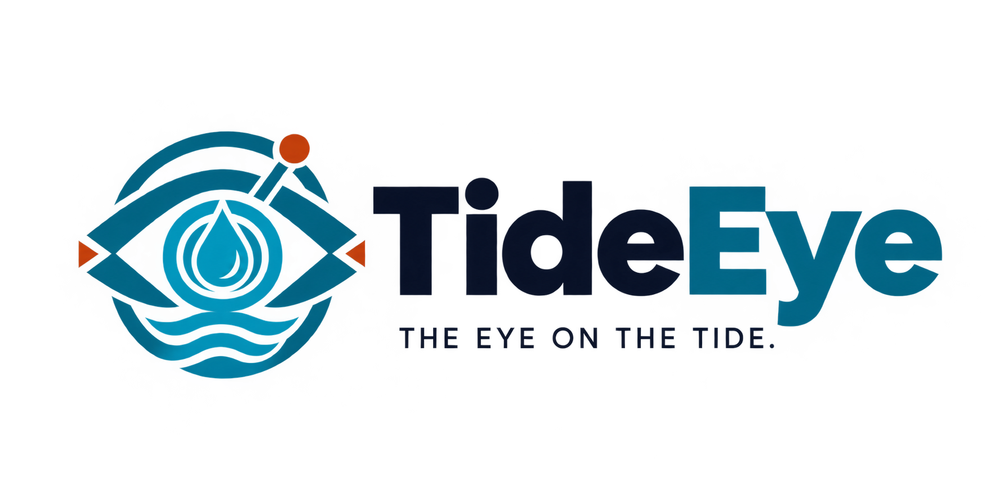

<div align="center">



### The eye on the tide.

**Satellite + AI water-safety monitoring that turns a map click into a plain-language
verdict, a shareable report, and a WhatsApp alert — for communities with no lab and
no sensors.**

[Live app](https://tideeye.shadrakbessanh.me) · [API](https://tideeye-api.shadrakbessanh.me/docs)

</div>

---

> **Advisory only.** TideEye is an early-warning and triage tool. It tells you *where
> to look and when to be careful* — it does **not** certify water safety or replace a
> laboratory test.

## Why TideEye

Hundreds of millions of people drink from lakes, rivers and ponds that **no one has
ever tested**. Testing needs labs, teams and budgets — impossible across thousands of
rural water points. So pollution, toxic algae and cholera are found **too late**.

TideEye closes that gap **from space**: free Sentinel-2 imagery already covers the
whole planet every few days. We turn it into a simple answer — *is this water safe
today?* — and put that answer, and the alert, into people's hands.

## What it does

1. **Pick a water point** on the map (or share your location).
2. TideEye frames a ~1 km area and pulls the **latest clear Sentinel-2 scene**.
3. It computes water-quality **spectral indices** (algae, turbidity, water) and a
   **deterministic risk score** (🟢 safe · 🟡 caution · 🔴 avoid).
4. An **AI writes the explanation and the actions** in plain, warm language — never
   changing the score.
5. You get a **rich report** (with the real satellite image and a scientific view),
   a downloadable **PDF**, and can **configure alerts**.

### Alerts & the WhatsApp assistant

- **Configure an alert** for a place with a list of phone numbers. Each number gets a
  friendly welcome, and TideEye **re-checks the water every day** and messages them
  (with the PDF) **whenever the satellite image changes**.
- A **WhatsApp assistant** answers people's questions about their water and
  observations (green water, smell, dead fish…) directly in the chat, powered by AI.

## How it works

```
 Map click ──▶ Sentinel-2 (Planetary Computer) ──▶ spectral indices ──▶ risk score
                                                                            │
        WhatsApp alerts ◀── PDF report ◀── plain-language AI explanation ◀──┘
                │
     daily re-check + conversational assistant (Baileys)
```

- **Deterministic core**: the indices and risk score are pure, reproducible math. The
  LLM only writes the human narrative — it can never move the risk band.
- **AI provider**: an OpenAI-compatible model is primary, with a fallback chain down
  to a deterministic narrator, so a session **never fails** on an LLM outage.

## Tech stack

| Layer | Tech |
|---|---|
| Frontend | Next.js 15 · React 19 · Tailwind · MapLibre GL |
| Analysis backend | FastAPI · Python · NumPy · rasterio · PostgreSQL + PostGIS |
| Imagery | Sentinel-2 L2A via Microsoft Planetary Computer (STAC) |
| AI narrative | OpenAI-compatible LLM (primary) → Gemini → deterministic fallback |
| Reports | WeasyPrint (branded PDF) |
| Alerts | Baileys (WhatsApp) — subscriptions, daily watch, conversational bot |
| Basemaps | Esri World Imagery · CARTO · OpenTopoMap |

## Repository layout

```
TideEye/
├── frontend/         # Next.js app (map, report, scientific view, alert config)
│   ├── app/          # routes: /, /map, /api/alert, /api/subscribe
│   ├── components/   # map, logo, risk pill
│   └── design-system/MASTER.md   # colors, type, rules
├── wa-service/       # WhatsApp service (Baileys): subscriptions + daily watch + bot
├── brand/            # logo brief (drop the final logo here)
├── assets/landing/   # landing imagery (Pexels, see ATTRIBUTION.md)
└── DIRECTIONS.md     # product roadmap
```
The Python analysis engine (adapted from the AquaLens reference) runs as a separate
service behind the API URL above.

## Configuration

All secrets are provided at runtime via environment variables (never committed):

| Variable | Where | Purpose |
|---|---|---|
| `NEXT_PUBLIC_API_URL` | frontend | analysis API origin |
| `NEXT_PUBLIC_CARTO_KEY` | frontend | CARTO basemap tiles |
| `WA_SERVICE_URL`, `WA_TOKEN` | frontend + wa | internal alert calls |
| `WA_PHONE` | wa | WhatsApp account to link (pairing code) |
| `ANALYSIS_API` | wa | backend the watcher analyses against |
| `TIDEEYE_LLM_BASE_URL/API_KEY/MODEL` | backend + wa | AI narrative & assistant |
| `GOOGLE_API_KEY` | backend | Gemini fallback |

## Status

Live and deployed. Satellite analysis, AI narrative, PDF reports, WhatsApp
subscriptions/alerts and the conversational assistant all work end-to-end.

## Credit & license

Built for the NextStep Hacks 2026 hackathon (theme *Earth Forward*). Sentinel-2
imagery © European Union, contains modified Copernicus data via the Microsoft
Planetary Computer. Landing photos from Pexels (see `assets/landing/ATTRIBUTION.md`).
